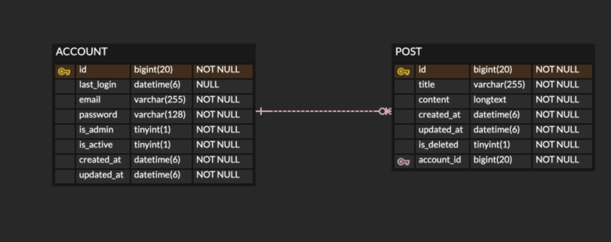

# 원티드 | 백엔드 프리온보딩 인터십 사전과제 
## 지원자 성명
사재혁
## 기술스택
### Backend :   
### Server :       
### Database : 
## 애플리케이션의 실행 방법
poetry 설치
```
curl -sSL https://install.python-poetry.org | python3 -
```
라이브러리 설치
```
poetry install --no-root
```
Django Env 세팅
```
SECRET_KEY="시크릿키"
DEBUG=디버그 유무
MYSQL_DB="데이터베이스"
DB_NAME="데이터베이스 이름"
DB_USER="데이터베이스 유저"
DB_PASSWORD="데이터베이스 유저 비밀번호"
DB_HOST="데이터베이스 호스트"
DB_PORT="데이터베이스 포트"
```
Django migrate
```
poetry run python manage.py migrate
```
Djnago 실행
```
poetry run python manage.py runserver
```
- 엔드포인트 호출 시 (로컬/원격)
- http://127.0.0.1:8000로 API 호출 보내기(로컬)h
- http://43.202.87.58로 API 호출 보내기(원격)
## 데이터베이스 테이블 구조


## 구현한 API의 동작 촬영한 데모 영상 링크
[Youtube Link](https://youtu.be/kmK6xFBxPmQ)

## 구현 방법 및 이유에 대한 간략한 설명
- Django 아키텍처(Layered아키텍처 적용한 이유)

    - 기존 문제점 
      - 기능 개선 및 추가가 진행됨에 따라 view단의 로직들이 절차지향적으로 늘어나 view 클래스 하나에 코드가 길어짐
      - 모듈별 역할이 정립되어있지 않아 view, model, serializer 등 서로의 다른 비즈니스 로직을 구현함에 코드가 중복, 유지보수 어려움
      - 협업 시에 개발자마다 코딩 스타일 차이로 인해 코드를 작성한 개발자만이 유지보수 가능해짐
    - 개선방향
      - 적절한 아키텍처와 디자인 패턴을 도입하고 모듈별 역할을 정의하여 코드 일관성 유지
      - 비즈니스 로직 통합하여 코드 역할 재정립
    - 문제해결
      - 모듈별 책임을 분명하게 하여 Layered아키텍처 적용
  
- 로그인, 회원가입 

  - simple jwt 라이브러리 사용
  - 직접 구현보다 안정성을 위함

- 게시글 리스트 조회

  - 간단하게 구현이 가능하여 DRF에서 제공하는 Pagination기능을 사용 

- 게시글 상세 조회, 생성, 수정, 삭제

  - 간단한 CRUD
## API 명세 (request/response 포함)
|Action| Method| URL|**Request**|Response|
|-----|----|----|----|----|
|회원가입| POST| /api/v1/account/signup|email, password|id, email, create_at, updated_at
|로그인(access)| POST| /api/v1/account/signup|email, password|access_token, refresh_token
|로그인(refresh)| POST| /api/v1/account/token|refresh_token|access_token
|게시글 생성| POST| api/v1/post |title, content | id, title, content, create_at, updated_at, account_id
|게시글 리스트 조회 | GET| api/v1/post?page||id, title, content, create_at, updated_at, account_id
|게시글 상세 조회| GET| api/v1/post/<int:post_id >|| id, title, content, create_at, updated_at, account_id
|특정 게시글 수정|PUT| api/v1/post/<int:post_id >|title, content|id, title, content, create_at, updated_at, account_id
|특정 게시글 삭제|DELETE| api/v1/post/<int:post_id >/||
## AWS 아키텍처
[http://43.202.87.58/](http://43.202.87.58)

- Github actions를 활용하여 무중단 배포(Blue/Green Deploy)
## docker compose 실행
- AWS EC2(ubuntu 22.04) 

docker 설치
```
sudo apt update
sudo apt install docker.io -y
```
docker compose 설치
```
sudo mkdir -p /usr/lib/docker/cli-plugins

sudo curl -SL https://github.com/docker/compose/releases/download/v2.11.2/docker-compose-linux-x86_64 -o /usr/lib/docker/cli-plugins/docker-compose

sudo chmod +x /usr/lib/docker/cli-plugins/docker-compose
```
docker compose 파일 실행(docker-compose.yml가 있어야함)
```
sudo docker compose up -d --build
```

## 테스트코드 유형
- 회원가입 테스트
  - 회원가입 성공
  - 회원가입 실패
    - 이메일 유효성검사
    - 비밀번호 유효성검사
    - 이메일 필드유무
    - 비밀번호 필드유무

- 로그인 테스트
  - 로그인 성공
  - 로그인 실패
    - 유저 이미 존재
    - 이메일 유효성검사
    - 비밀번호 유효성검사
    - 이메일 필드유무
    - 비밀번호 필드유무

- 게시글 생성
  - 게시글 생성 성공
  - 게시글 생성 실패
    - 비회원
    - 제목 필드유무
    - 내용 필드유무

- 게시글 리스트 조회
  - 게시글 조회 성공
  - 게시글 조회 실패
    - 비회원

- 게시글 상세 조회
  - 게시글 조회 성공
  - 게시글 조회 실패
    - 비회원
    - 찾을 수 없음

- 게시글 수정
  - 게시글 수정 성공
  - 게시글 수정 실패
    - 비회원
    - 다른 유저
    - 찾을 수 없음
    - 제목 필드유무
    - 내용 필드유무


- 게시글 삭제
  - 게시글 삭제 성공
  - 게시글 삭제 실패
    - 비회원
    - 다른 유저
    - 찾을 수 없음
    - 제목 필드유무
    - 내용 필드유무

